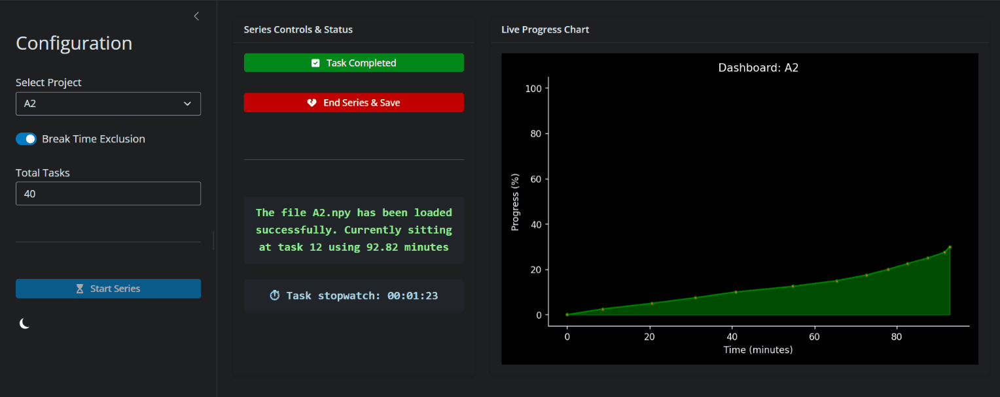
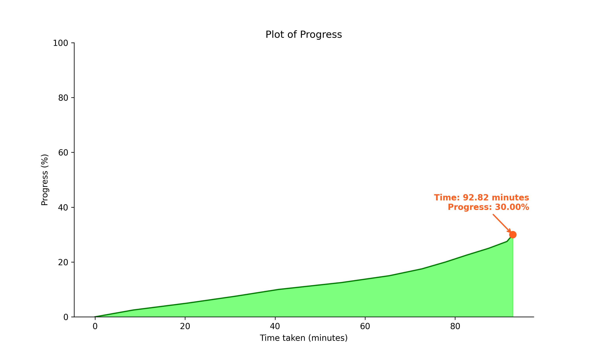

# Progress Tracker (Shiny Web App)

A simple, lightweight web application built with Shiny for Python to help track task completion over time. It's nothing too fancy—just a handy tool to keep track of your workflow, save your sessions, and visualize your momentum.

## Features

This application provides an interactive web dashboard, with the option to choose dark mode, accessible from your computer or any device on your local network.

 As you complete tasks, it automatically generates and updates a live progress chart. To ensure you never lose your data, the app manages your sessions by saving your progress locally as `.npy` binary files, allowing you to seamlessly pick up right where you left off. It features smart time tracking—letting you choose whether to include or omit break times when resuming a session—and will dynamically rescale your historical data if you decide to change your total task goal mid-project. Furthermore, whenever you end a series, the tracker automatically saves a high-resolution `.png` snapshot of your final chart alongside your data files.
 
 All of this is monitored through a minimal, color-coded logging terminal that highlights important metrics in real-time.

## Folder Structure

To keep things organized, the project is split into two main directories:

    ProgressTracker/
    │
    ├── App/
    │   └── app.py         # The Shiny web app, UI layout, and reactive server logic.
    │
    └── Data/
        ├── tracker.py     # The core Python class handling math, plots, and file saving.
        ├── *.npy          # Your saved session binary files will appear here automatically.
        └── *.png          # Automatically generated snapshots of your saved charts.

## How to Run

1. **Install Requirements:** Make sure you have the required Python libraries installed:

    ```bash
    pip install shiny matplotlib numpy faicons
    ```

2. **Start the App:** Navigate to the project folder and run the `app.py` script:

    ```bash
    python App/app.py
    ```

3. **Access the Dashboard:** * On your computer: Open a web browser and go to `http://localhost:8000`or `http://127.0.0.1:8000`
    * On your phone/tablet: Find your computer's local IP address (e.g., `192.168.1.x`) and visit `http://192.168.1.x:8000`.

## How to Use

1. Use the sidebar to either select an existing project or choose "Create new...".
2. Set your **Total Tasks** goal.
3. Click **Start Series**.
4. Every time you finish a sub-task, click **Task Completed**. The chart and logs will update.
5. When you're done for the day (or finish the whole project), click **End Series & Save**.